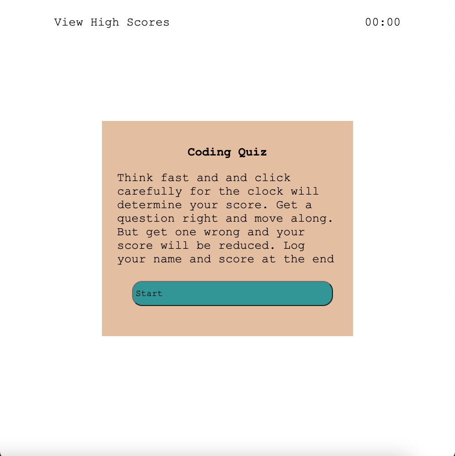

# <JS-Quiz-App>

## Description

This was developed to provide a short quiz with several questions about JavaScript. You'll race the clock as you answer questions and progress to the next question upon answering the current question. If you get one wrong, your score drops. 

- I was motivated to make this from a desire to expand my understanding of DOM manipulation and JavaScript.
- I built this project to fulfill my desire of expanding my understanding of DOM manipulation and JavaScript
- From developing this app I learned that I don't want to do this with my life and that I'm awful at writing code. I learned that taking Xanax again after spending two years coming off of it is better than having another panic attack from doing this. I learned that writing code makes me extremely anxious and can cause me to have a panic attack.
- I learned about a hand full of JS functions

## Installation

Just follow this link and follow the instructions

## Usage

Follow the link and click start. click on the correct answers to not make your score drop faster. log your score at the end

    

## Credits

Everitt Gill

## Features

Count down timer, functional buttons, timer integrates with your score, Spirited Away color palate.

